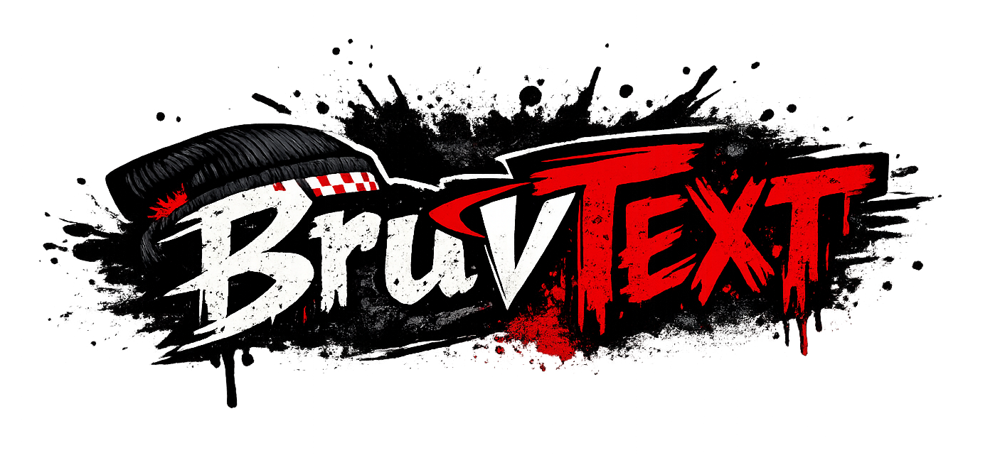

# bruvtext

Boring Rudimentary Vulkan Text.

`bruvtext` is meant to be a vendorable text rendering library for Vulkan projects.
The intended workflow is:

1. clone this repo into your project tree
2. include it in your build
3. update it with normal `git pull`

The goal is not to be a giant UI framework. The goal is to give Vulkan projects
an explicit, debuggable text stack that can handle major real-world languages
without rerasterizing whole strings every frame.

## Goals

- vendorable into private or public Vulkan projects
- explicit C or C++ friendly API shape
- GPU-rendered text from cached glyph atlases
- lazy atlas generation by font and size
- shaping and glyph positioning for real languages
- support for multilingual HUD, debug text, labels, menus, and dialogue
- boring enough to debug in a renderer

## Planned Stack

- `FreeType` for font loading and glyph rasterization
- `HarfBuzz` for shaping, glyph selection, kerning, ligatures, and positioning
- optional bidi helper later if needed for mixed RTL/LTR text
- Vulkan quad rendering over cached atlases

## Scope

The first milestone should focus on:

- English
- French
- Spanish
- German
- Italian
- Portuguese
- Dutch
- Vietnamese
- Polish
- Turkish
- Romanian
- Czech
- Swedish
- Japanese
- Simplified Chinese
- Traditional Chinese
- Korean
- Arabic
- Hindi

So the current demo scope now covers both the broad Latin-script set and the first
major non-Latin script jump.

Even for the first milestone, the library should be built with:

- font fallback support
- per-font glyph caches
- lazy atlas growth by size
- shaping-driven glyph positioning

## Demo Requirements

The repo should ship with a demo mode that proves the system is real, not just
ASCII debug text.

The demo should include:

- a font fallback chain that covers the target languages
- lazy atlas creation for multiple font sizes
- short UI labels
- long paragraphs
- wrapping
- mixed punctuation
- a glyph coverage view
- an atlas debug view

The demo should make it easy to answer:

- did shaping work
- did fallback work
- did the atlas cache work
- did the glyph positioning work
- does the final Vulkan output actually look correct

## Language Test Content

For each target language, the demo should include:

- a short sentence
- a full paragraph of real text
- a punctuation and number line
- a glyph stress line for common characters
- font size coverage at several sizes

For CJK, the demo should also include:

- enough common glyphs to exercise cache growth
- multi-line paragraphs
- punctuation and spacing checks

## Current Direction

The intended rendering path is:

1. shape text into positioned glyphs
2. look up each shaped glyph in a glyph atlas cache
3. rasterize only cache misses
4. upload or patch atlas pages lazily
5. draw glyph quads in Vulkan

That keeps CPU work focused on shaping and cache misses instead of rerendering
whole strings every frame.

## Atlas Tolerance Behavior

Atlas tolerance is intended to affect cache reuse, not text layout.

The intended behavior is:

- requested text size always drives shaping, advances, wrapping, and placement
- atlas tolerance only affects which cached glyph bitmap size is used
- tolerance `0` means exact-size glyph atlases
- higher tolerance means nearby requested sizes may share the same atlas bucket

What should change when tolerance changes:

- atlas page count
- atlas size-bucket count
- atlas memory usage
- bitmap sharpness if reuse gets aggressive

What should not change when tolerance changes:

- glyph order
- line breaks caused by shaping/layout
- requested text size semantics
- baseline flow and general text placement logic

If layout changes dramatically when tolerance changes, that is a bug.

The current demo is supposed to make this visible:

- `-` / `=` changes the featured text size
- `[` / `]` changes atlas tolerance
- `C` clears the active feature font cache

The intended demo read is:

- with tolerance `0`, changing text size should create more exact-size buckets over time
- with higher tolerance, the active font should reuse atlas buckets more often
- memory and bucket counts should grow more slowly at higher tolerance
- if the image degrades, it should degrade as bitmap quality, not as broken layout

## Ease Of Use Versus Low Opinion

The intended design is:

- a low-opinion core that produces glyph atlases, atlas updates, and draw data
- a simple high-level API on top so normal projects can just call `draw_text(...)`

That means users should not have to think about shaping every time they draw a label.
They should be able to do something like:

```cpp
bruvtext_draw_text(ctx, &cmd);
```

with a command that contains:

- font or style handle
- position
- size
- color
- string

Internally, the library can stay explicit and cache-oriented without forcing every
host project to build a text system from scratch.

## Documentation

- [Library Spec](docs/library-spec.md)
- [Vulkan Integration](docs/vulkan-integration.md)
- [GPU Renderer Gap](docs/gpu-renderer-gap.md)
